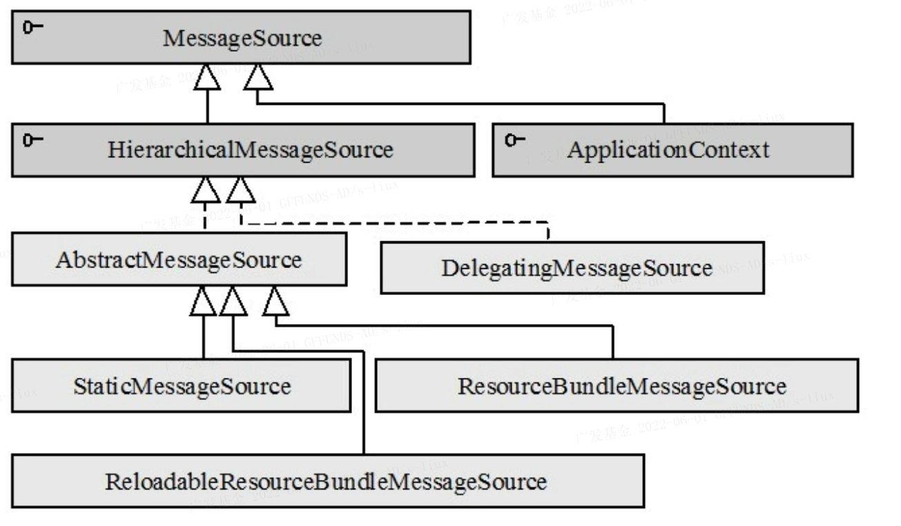
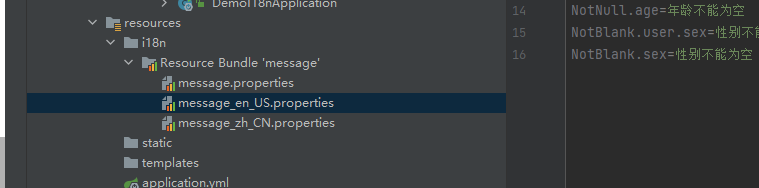

## 背景

 现代软件开发，往往做出的应用程序不止给一个国家的人去使用。不同国家的人往往存在语言文字不通的问题。由此产生了国际化(internationalization)、多语言(multi-language)、本地化(locale)
这些词，它们其实都是一个意思，支持多种语言，提供给不同国家的用户使用。

## 语言编码、国家/地区编码

进行web开发时一般接触过类似 zh-cn, en-us 这样的编码字样，这些编码是用来表示指定的国家地区的语言类型的；

**列如：**

​        **ISO-639**标准使用编码定义了国际上常见的**语言**，每一种语言由两个小写字母表示。

​        **ISO-3166**标准使用编码定义了**国家/地区**，每个国家/地区由两个大写字母表示

**为什么要用语言+国家/地区来标示语言呢？**

		道理很简单：在同一个国家，不同地方都有不一样的方言，因此需要国家或者地区

**下表列举了一些常见国家、地区的语言编码：**

| 国家/地区          | 语言编码 | 国家/地区          | 语言编码 |
| ------------------ | -------- | ------------------ | -------- |
| 简体中文(中国)     | zh-cn    | 繁体中文(中国台湾) | zh-tw    |
| 繁体中文(中国香港) | zh-hk    | 英语(中国香港)     | en-hk    |
| 英语(美国)         | en-us    | 英语(英国)         | en-gb    |
| 英语(全球)         | en-ww    | 英语(加拿大)       | en-ca    |
| 英语(澳大利亚)     | en-au    | 英语(爱尔兰)       | en-ie    |
| 英语(芬兰)         | en-fi    | 芬兰语(芬兰)       | fi-fi    |
| 英语(丹麦)         | en-dk    | 丹麦语(丹麦)       | da-dk    |
| 英语(以色列)       | en-il    | 希伯来语(以色列)   | he-il    |
| 英语(南非)         | en-za    | 英语(印度)         | en-in    |
| 英语(挪威)         | en-no    | 英语(新加坡)       | en-sg    |
| 英语(新西兰)       | en-nz    | 英语(印度尼西亚)   | en-id    |
| 英语(菲律宾)       | en-ph    | 英语(泰国)         | en-th    |
| 英语(马来西亚)     | en-my    | 英语(阿拉伯)       | en-xa    |
| 韩文(韩国)         | ko-kr    | 日语(日本)         | ja-jp    |
| 荷兰语(荷兰)       | nl-nl    | 荷兰语(比利时)     | nl-be    |
| 葡萄牙语(葡萄牙)   | pt-pt    | 葡萄牙语(巴西)     | pt-br    |
| 法语(法国)         | fr-fr    | 法语(卢森堡)       | fr-lu    |
| 法语(瑞士)         | fr-ch    | 法语(比利时)       | fr-be    |
| 法语(加拿大)       | fr-ca    | 西班牙语(拉丁美洲) | es-la    |
| 西班牙语(西班牙)   | es-es    | 西班牙语(阿根廷)   | es-ar    |
| 西班牙语(美国)     | es-us    | 西班牙语(墨西哥)   | es-mx    |
| 西班牙语(哥伦比亚) | es-co    | 西班牙语(波多黎各) | es-pr    |
| 德语(德国)         | de-de    | 德语(奥地利)       | de-at    |
| 德语(瑞士)         | de-ch    | 俄语(俄罗斯)       | ru-ru    |
| 意大利语(意大利)   | it-it    | 希腊语(希腊)       | el-gr    |
| 挪威语(挪威)       | no-no    | 匈牙利语(匈牙利)   | hu-hu    |
| 土耳其语(土耳其)   | tr-tr    | 捷克语(捷克共和国) | cs-cz    |
| 斯洛文尼亚语       | sl-sl    | 波兰语(波兰)       | pl-pl    |
| 瑞典语(瑞典)       | sv-se    |                    |          |

**注：由表中可以看出语言、国家/地区 编码一般都是英文单词的缩写。**

## 字符编码

在此处，引申一下字符编码的概念。

**是不是有了语言、国家/地区编码，计算机就可以识别各种语言了？**

答案是否。作为程序员，相信每个人都会遇到过这样的情况：期望打印中文，结果输出的却是乱码。

这种情况，往往是因为字符编码的问题。

计算机在设计之初，并没有考虑多个国家，多种不同语言的应用场景。当时定义一种**ASCII**码，将字母、数字和其他符号编号用**7**
比特的二进制数来表示。后来，计算机在世界开始普及，为了适应多种文字，出现了多种编码格式，例如中文汉字一般使用的编码格式为**GB2312**、**GBK**。

由此，又产生了一个问题，**不同字符编码之间互相无法识别**。于是，为了一统江湖，出现了 **unicode**编码。它为每种语言的每个字符设定了统一并且唯一的二进制编码，以满足跨语言、跨平台的文本转换需求。

有人不禁要问，**既然** **Unicode** **可以支持所有语言的字符，那还要其他字符编码做什么**？

Unicode 有一个缺点：为了支持所有语言的字符，所以它需要用更多位数去表示，比如ASCII表示一个英文字符只需要一个字节，而 Unicode 则需要两个字节。很明显，如果字符数多，这样的效率会很低。

为了解决这个问题，有出现了一些中间格式的字符编码：如UTF-8、UTF-16、UTF-32等。像我们一般使用**UTF-8**编码。

## 国际化的 Java 实现

 所有的语言文字在计算机中都是字符串。所以，**实现国际化，归根结底就是根据语言类型去定义好字符串模板而已**。对于所有编程语言都**常见的做法是定义** **XML**：为每种语言添加一个 XML 文件，在 XML
文件中定义需要的字符串模板，并指定一个唯一的标识ID。只要熟悉对应编程语言的 XML 库方法，实现非常简单。因为本文目的是介绍 Java 特色的国际化实现，这里不再详述 XML 实现方式。

## Java中实现国际化的方法

### 定义 properties

**实现国际化，归根结底就是根据语言类型去定义好字符串模板而已。**

Java 中的多语言字符串模板一般保存在properties资源文件中。

它必须遵照以下的命名规范：

**<资源名> __ <语言代码>__<国家/地区代码>.properties**

其中，语言代码和国家/地区代码都是可选的。

<资源名>.properties命名的国际化资源文件是**默认的资源文件**，即某个本地化类型在系统中找不到对应的资源文件，就采用这个默认的资源文件。

例：

定义中英文两种多语言资源文件，将其置于com.notes.locale.resources 路径下。

```java
        helloWorld=HelloWorld!
        time=Thecurrenttimeis%s.
```

**content_zh_CN.properties**

```java

        helloWorld= \u4e16\u754c\uff0c\u4f60\u597d\uff01
        time= \u5f53\u524d\u65f6\u95f4\u662f\u0025\u0073\u3002
```

可以看到，两种语言的Key 完全一致，只是 Value 是对应语言的字符串。

本地化不同的同一资源文件，虽然属性值各不相同，但属性名却是相同的，这样应用程序就可以通过Locale对象和属性名精确调用到某个具体的属性值了。

本文的字符编码中提到了，为了达到跨编码也正常显示的目的，有必要将非ASCII 字符转为 Unicode 编码。上面的中文资源文件就是中文转为 Unicode 的结果。

### Unicode 转换工具

JDK在bin目录下为我们提供了一个Unicode 转换工具：**native2ascii**。

它可以将中文字符的资源文件转换为Unicode代码格式的文件，命令格式如下：

**native2ascii [-reverse] [-encoding编码] [输入文件 [输出文件]]**

例：

假设content_zh_CN.properties 在d:\ 目录。执行以下命令可以新建 content_zh_CN_new.properties ，其中的内容就所有中文字符转为 UTF-8 编码格式的结果。

native2ascii -encoding utf-8 d:\content_zh_CN.properties d:\content_zh_CN_new.properties

### 加载资源文件

定义了多语言资源文件，下一步就是加载资源文件了。

Java为我们提供了用于加载本地化资源文件的工具类：**java.util.ResourceBoundle**。

使用方式见下例：

```java
        Locale localeEn=new Locale("en","US");

        Locale localeZh=new Locale("zh","CN");

        ResourceBundle rbEn=ResourceBundle.getBundle("com.notes.locale.resources.content",localeEn);

        ResourceBundle rbZh=ResourceBundle.getBundle("com.notes.locale.resources.content",localeZh);

        System.out.println("us-US:"+rbEn.getString("helloWorld"));

        System.out.println("us-US:"+String.format(rbEn.getString("time"),"08:00"));

        System.out.println("zh-CN："+rbZh.getString("helloWorld"));

        System.out.println("zh-CN："+String.format(rbZh.getString("time"),"08:00"));
```

需要**说明**的是：**ResourceBundle**类的 **getBundle**方法第一个参数 **baseName**需要输入的是资源文件的package路径 + 文件前缀。

以本文例子来说，content_zh_CN.properties 和content_en_US.properties 的baseName 都是：com.notes.locale.resources.content。

在加载资源时，如果指定的本地化资源文件不存在，它会尝试按下面的顺序加载其他的资源：本地系统默认本地化对象对应的资源-> 默认的资源。如果指定错误，Java 会提示找不到资源文件。

**输出：**

```java
        us-US:Hello World!

        us-US:The current time is 08:00.

        zh-CN：世界，你好！

        zh-CN：当前时间是08:00。
```

# 支持国际化的国际化工具类

Java 中也提供了几个支持国际化的格式化工具类。例如：**NumberFormat**、**DateFormat**、**MessageFormat**

## NumberFormat

NumberFormat 是所有数字格式类的基类。它提供格式化和解析数字的接口。它也提供了决定数字所属语言类型的方法;

```java
        Locale locale=new Locale("en","US");

        NumberFormat format=NumberFormat.getCurrencyInstance(locale);

        double num=123456.78;

        System.out.println("51423.45 Format:");

        System.out.println(String.format("%s : %s",locale.toString(),format.format(num)));
```

**输出：**

```java
        51423.45Format:
        en_US:$123,456.78
```

## DateFormat

DateFormat 是日期、时间格式化类的抽象类。它支持基于语言习惯的日期、时间格式。

```java
        Date date=new Date();

        DateFormat df=DateFormat.getDateInstance(DateFormat.MEDIUM,new Locale("zh","CN"));

        DateFormat df2=DateFormat.getDateInstance(DateFormat.MEDIUM,new Locale("en","US"));

        System.out.println(df.format(date));

        System.out.println(df2.format(date));
```

**输出：**

```java
        2022年5月30日
        May 30,2022
```

## MessageFormat

Messageformat 提供一种与语言无关的拼接消息的方式。通过这种拼接方式，将最终呈现返回给使用者。

```java
        String pattern1="{0}，你好！你于  {1} 消费  {2} 元。";

        String pattern2="At {1,time,short} On {1,date,long}，{0} paid {2,number, currency}.";

        Object[]params={"Jack",new GregorianCalendar().getTime(),8888};

        String msg1=MessageFormat.format(pattern1,params);

        MessageFormat mf=new MessageFormat(pattern2,Locale.US);

        String msg2=mf.format(params);

        System.out.println(msg1);

        System.out.println(msg2);
```

```java
        Jack，你好！你于 2022/5/30上午9:01消费 8,888元。
        At 9:01AM On May 30,2022，Jack paid $8,888.00.
```

## Spring Boot 实现国际化

Spring Boot 和 Spring 一脉相承，对于国际化的支持，默认是通过 **AcceptHeaderLocaleResolver **解析器来完成的，这个解析器，默认是通过请求头的 Accept-Language 字段来判断当前请求所属的环境的，进而给出合适的响应；Spring定义了访问国际化信息的**MessageSource**接口，并提供了几个易用的实现类。首先来了解一下该接口的几个重要方法：

**1）String getMessage(String code, Object[] args, String defaultMessage, Locale locale) code**

表示国际化资源中的属性名；args用于传递格式化串占位符所用的运行期参数；当在资源找不到对应属性名时，返回defaultMessage参数所指定的默认信息；locale表示本地化对象；

**2）String getMessage(String code, Object[] args, Locale locale) throws NoSuchMessageException**

与上面的方法类似，只不过在找不到资源中对应的属性名时，直接抛出NoSuchMessageException异常；

**3）String getMessage(MessageSourceResolvable resolvable, Locale locale) throws NoSuchMessageException**

MessageSourceResolvable 将属性名、参数数组以及默认信息封装起来，它的功能和第一个接口方法相同。



MessageSource分别被HierarchicalMessageSource和ApplicationContext接口扩展，这里我们主要看一下HierarchicalMessageSource接口的几个实现类

**HierarchicalMessageSource**接口添加了两个方法，建立父子层级的MessageSource结构，该接口的setParentMessageSource (MessageSource parent)
方法用于设置父MessageSource，而getParentMessageSource()方法用于返回父MessageSource。

HierarchicalMessageSource接口最重要的两个实现类是**ResourceBundleMessageSource**和**ReloadableResourceBundleMessageSource**
。它们基于Java的ResourceBundle基础类实现，允许仅通过资源名加载国际化资源。ReloadableResourceBundleMessageSource提供了**定时刷新**
功能，允许在不重启系统的情况下，更新资源的信息。StaticMessageSource主要用于程序测试，它允许通过**编程的方式**
提供国际化信息。而DelegatingMessageSource是为方便操作父MessageSource而提供的代理类。

## 项目国际化

目前在项目里国际化主要对返回的异常信息进行国际化处理，对应spring boot 进行定制了处理，实现LocaleResolver，可以根据Accept-Language进行区域信息解析，重新构造区域信息对象；

1）生成国际化配置文件，如下图所示:




2)根据生成文件名称在yml里配置对应的解析文件名称，如下图所示：


3）自定义解析器，进行解析请求头，判断当前环境，如下所示：

```java
public class MyLocaleResolver implements LocaleResolver {
    @Override
    public Locale resolveLocale(HttpServletRequest httpServletRequest) {
        //获取请求中参数
        String acceptLanguage = httpServletRequest.getHeader("Accept-Language");
        //获取默认的区域信息解析器
        Locale locale = Locale.getDefault();
        //根据请求中的参数重新构造区域信息对象
        if (StringUtils.hasText(acceptLanguage)) {
            String[] s = acceptLanguage.split("_");
            locale = new Locale(s[0], s[1]);
        }
        return locale;

    }
    @Override
    public void setLocale(HttpServletRequest httpServletRequest, HttpServletResponse httpServletResponse, Locale locale) {

    }
}
```

4）加载国际化文件以及注入自定义解析器

```java
@Configuration
public class LocaleConfig {
    /**
     * 默认解析器 其中locale表示默认语言
     */
    @Value(value = "${spring.messages.basename}")
    private String basename;

    @Bean(name = "messageSource")
    public ResourceBundleMessageSource getMessageResource() {
        ResourceBundleMessageSource messageSource = new ResourceBundleMessageSource();
        messageSource.setBasename(basename);
        messageSource.setDefaultEncoding("UTF-8");
        return messageSource;
    }

    /**
     * 设置默认语言
     *
     * @return
     */
    @Bean
    public LocaleResolver localeResolver() {
        return new MyLocaleResolver();
    }


}

```


**使用方式：**

​	1)主要是针对对参数进行校验时，不需要指定message消息，按照所指定的配置规则，进行国际化配置即可

```java
 @ExceptionHandler(MethodArgumentNotValidException.class)
    public ReturnResult exceptionHandle(MethodArgumentNotValidException e) {
        e.printStackTrace();
        log.error("捕获到异常：{}", e.getMessage());
        log.error("入参格式错误，错误原因：", e);
        //得到所有的属性错误
        List<FieldError> fieldErrors = e.getBindingResult().getFieldErrors();
        StringBuilder errorMsg = new StringBuilder();
        fieldErrors.forEach(error -> {
            String[] codes = error.getCodes();
            if (codes != null) {
                String message = null;
                for (int i = 0; i < codes.length; i++) {
                    String code = codes[i];
                    if (code != null) {
                        try {
                            message = messageSourceHandler.getMessage(code);
                            break;
                        } catch (NoSuchMessageException messageException) {
                            if (i == codes.length - 1) {
                                log.warn("请配置对应的国际化信息{}", Arrays.toString(codes));
                            }
                        }
                    }
                }
                if (message != null) {
                    errorMsg.append(message).append(";");
                } else {
                    errorMsg.append(error.getDefaultMessage()).append(";");
                }
            }
        });
        return new ReturnResult(ErrCodeEnum.PARAM_VALIDATED_ERROR.code(), errorMsg.toString());
    }
```

​	2)主要是针对异常处理，不需要在异常消息里具体的中文说明，只需要指定具体的国际化code即可

```java
    /**
     * 基础异常处理
     *
     * @param e
     * @return
     */
    @ExceptionHandler(BaseException.class)
    public ReturnResult exceptionHandle(BaseException e) {
        e.printStackTrace();
        log.error("捕获到异常：{}", e.getMessage());
        ReturnResult result = ReturnResult.fail(ErrCodeEnum.ERR_UNKNOWN.code(), ErrCodeEnum.INTERNAL_SERVER_ERROR.msg());
        if (StringUtils.hasText(e.getMessage())) {
            // 不属于国际化异常
            result = ReturnResult.fail(e.getCode(), e.getMessage());
        } else {
            try {
                String message = messageSourceHandler.getMessage(ErrCodeEnum.getEnum(e.getCode()).msg(), e.getParams());
                result = ReturnResult.fail(e.getCode(), message);
            } catch (NoSuchMessageException noSuchMessageException) {
                log.warn("请配置对应的国际化信息{}", e.getMessage());
            }
        }

        return result;
    }
```


## 异常返回消息

- 必须选择合适的状态码
- 向前端返回详细的错误信息
- 针对默认返回与`API`维护


### 对于通用的异常必须进行说明

* **正例**

```java
public enum ErrCodeEnum {
    /**
     * 成功
     */
    SUCCESS(200, "SUCCESS"),
    /**
     * 系统内部错误
     */
    INTERNAL_SERVER_ERROR(-1, "INTERNAL_SERVER_ERROR"),
    /**
     * 请求参数异常
     */
    REQUEST_ABNORMAL(-2, "REQUEST_ABNORMAL"),
    /**
     * 参数校验错误
     */
    PARAM_VALIDATED_ERROR(-3, "PARAM_VALIDATED_ERROR"),
    /**
     * 业务逻辑异常
     */
    REST_EXCEPTION(-4, "REST_EXCEPTION"),

    /**
     * 数据不存在
     */
    NO_DATA(-5, "NO_DATA"),
    /**
     * 未定义异常
     */
    ERR_UNKNOWN(-6, "ERR_UNKNOWN"),

    /**
     * 用户不存在
     */
    USER_NOT_EXIST(-7, "USER_NOT_EXIST");

    private int code;
    private String msg;

    ErrCodeEnum(int code, String msg) {
        this.code = code;
        this.msg = msg;
    }

    public String msg() {
        return msg;
    }

    public int code() {
        return code;
    }

    public static ErrCodeEnum getEnum(int code) {
        for (ErrCodeEnum errCode : ErrCodeEnum.values()) {
            if (errCode.code == code) {
                return errCode;
            }
        }
        return ERR_UNKNOWN;
    }
}

```

* **反例**

```java
 if(!result.isSuccess()){
        if("-2".equals(result.getCode)){<<<调用方按API提供方的错误码值做硬编码，代码耦合。一旦错误码调整那么需要同步修改
        //参数校验失败
        ...
        }else{
        ...
        }
        }
```

### 【推荐】返回具备可读性，引导性的错误提示信息

* **正例**

```yaml
USER_NOT_EXIST=User: [{0}] does not exist, please confirm whether the userName is correct
```

* **反例**

```java
 public OperationLogDto saveLog(long serialNo,List<Object[]>list){
        OperationLogDto dto=new OperationLogDto();
        dto.setSerialNo(serialNo);
        try{
        WholeDb.getInstance().executeCommand(INSERT_LOG_SQL,list);
        }catch(Exception e){
        dto.setErrorCode(1);
        dto.setMsg(e.getMessage());
        }
        return dto;
        }
```

### 【推荐】根据不同业务场景，定制不同异常

* **正例**

```java
package com.liux.demoi18n.common.exception;

import lombok.Data;

/**
 * @author :liuxin
 * @version :V1.0
 * @program : demo-i18n
 * @date :Create in 2022/7/28 11:11
 * @description :基础异常
 */
@Data
public class BaseException extends Exception {

    private int code;

    private String message;

    private Object[] params;

    public BaseException() {
    }

    public BaseException(String message) {
        super(message);
        this.message = message;
    }

    public BaseException(String message, Throwable cause) {
        super(message, cause);
        this.message = message;
    }


    public BaseException(Throwable cause) {
        super(cause);
    }

    public BaseException(int code, String message) {
        super(message);
        this.code = code;
        this.message = message;
    }

    public BaseException(int code, Object[] params) {
        this.code = code;
        this.params = params;
    }

}

```


* **反例**

```java

@Override
public ReturnResult ruleCheckPass(RuleCheckResultQueryDto ruleCheckResultQueryDto)throws Exception{
       // 
    throw new NoSuchPaddingException();
        }
```

```java
 public Object call(InputData inputData)throws IOException,NoSuchPaddingException,NoSuchAlgorithmException,IllegalBlockSizeException,BadPaddingException,DocumentException,InvalidKeyException,InvalidKeySpecException{
        //业务逻辑
        }
```

